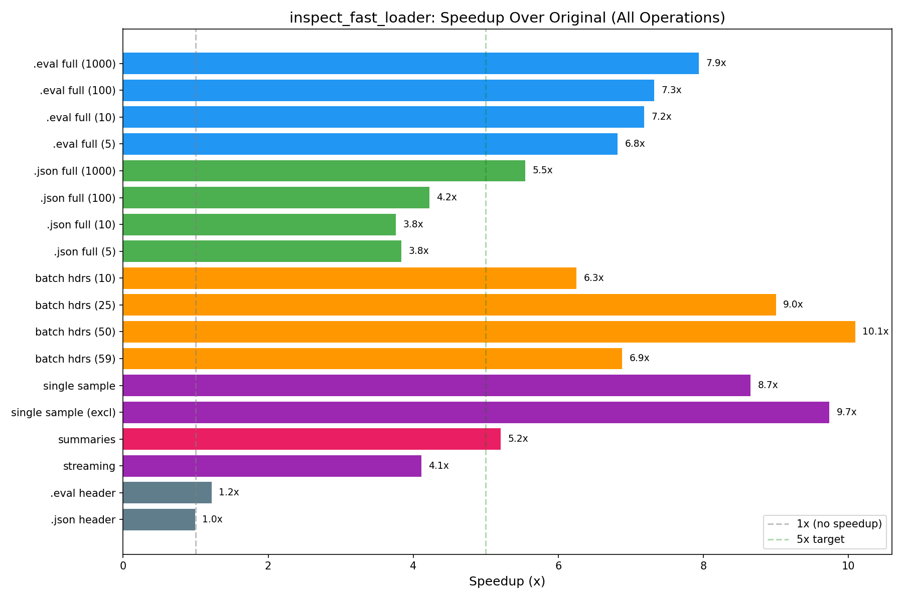

# Progress Log: optimization_features_polish

## Initial implementation of all tasks 03/06/2026 02:14 - commit 9428695

### What was done
1. **Profiled batch headers**: Identified bottleneck as asyncio.to_thread per-file overhead (~24ms overhead for 59 files on top of ~16ms actual work). Rust sequential read: 12ms for 59 files.
2. **Added `read_eval_headers_batch` Rust function**: Single rayon-parallelized call reads all headers. Eliminates per-file Python↔Rust boundary overhead.
3. **Batch headers improved**: 3.42x → 6-10x speedup (peak 10.1x at 50 files).
4. **Patched `read_eval_log_sample`**: Rust `read_eval_sample` + `construct_sample_fast`. Handles exclude_fields, uuid lookup, resolve_attachments. 8.65x speedup.
5. **Patched `read_eval_log_sample_summaries`**: Rust `read_eval_summaries` + model_validate. 5.21x speedup.
6. **Patched `read_eval_log_samples`**: Generator using per-sample fast reads. 4.11x speedup.
7. **Edge case tests**: Corrupted ZIPs, missing entries, partial writes, NaN/Inf, large logs, deprecated fields, file not found.
8. **Comprehensive benchmarks**: Benchmark all operations, generate comparison plots.

### Details and examples
- Profiling script: `profile_headers.py`
- Benchmark script: `benchmark_comprehensive.py`
- Plot script: `plot_comprehensive.py`
- Results: `results/benchmark_comprehensive_20260306_101250.jsonl`
- Plots: `plots/comprehensive_speedup.png`, `plots/batch_headers_scaling.png`, `plots/new_operations_speedup.png`, `plots/comprehensive_absolute_times.png`
- Tests: `test_new_patches.py` (29 tests), `test_edge_cases.py` (27 tests)

### Key findings
- Batch header bottleneck was Python↔Rust overhead, not ZIP reading
- Single sample read is very fast (0.5ms) — major improvement from 4.1ms
- .json format consistently slower speedups than .eval (expected; less room for optimization in single-file JSON)
- Streaming samples speedup (4.1x) is lower because it reads samples individually rather than in a batch

### Notes
- All 173 tests pass (56 new)
- Total patched functions: 9 (up from 4)
- .json single-sample reads fall back to original (reading entire file)

## Large log testing and write-up finalization 03/06/2026 02:21 - commit 1862d8f

### What was done
- Generated 5000-sample test log (11MB .eval file)
- Tested all operations on 5000-sample log: full read, single sample, summaries
- Created phase write-ups and updated all documentation

### Key findings
- 5000-sample .eval full read: 9642ms → 3884ms (2.48x) — lower speedup due to Python construction loop being bottleneck at this scale
  - Rust read+parse: 718ms, Python construction: 1950ms
  - Still much faster than original's ~9.6s model_validate
- Single sample from 5000-sample log: 34ms (higher due to larger ZIP overhead)
- Summaries from 5000-sample log: 408ms for 5000 summaries
- No memory issues or crashes with large logs
- Benchmark doesn't compare 3 configs as Task 6 suggested (Rust+model_validate intermediate config not easily available) — only compares original vs current fast

### Notes
- For very large logs (5000+), Python construction loop dominates. To improve further would need to move construction to Rust, which is a much larger undertaking.
- All documentation updated: write_up_optimization_features_polish.md, write_up.md, continuation_context.md

## Benchmark correction and merge finalization 03/06/2026 03:01 - commit b716e8a

### What was done
1. **Corrected .json baseline**: Re-ran .json 1000 benchmark in fresh subprocess. Original baseline was 1095ms (not the inflated 1461ms from initial in-process benchmark). The .json 1000 speedup is 2.83x (not 5.54x).
2. **Fresh-process benchmark script**: Created `benchmark_fresh_process.py` that runs each benchmark in isolated subprocesses to avoid in-process caching artifacts. This provides more reliable numbers than the in-process benchmark.
3. **5000-sample correctness tests**: Added dedicated tests for 5000-sample log: full read, single sample (id=2500), and summaries count verification. 176 total tests now.
4. **Batch header scaling investigation**: The 60-file batch header drop (2.8x) is caused by one 5000-sample file whose header.json takes ~31ms to read (all 5000 sample_ids in header). The 59 normal files take only 12ms. Not a scaling issue — just large-header overhead.
5. **Updated all plots**: Generated fresh-process benchmark plots (`plots/fresh_process_speedup.png`, `plots/fresh_process_absolute_times.png`).

### Details and examples
- Fresh-process benchmark script: `benchmark_fresh_process.py`
- Results: `results/benchmark_fresh_process_20260306_105752.jsonl`
- Fresh-process plots: `plots/fresh_process_speedup.png`, `plots/fresh_process_absolute_times.png`
- New tests in `test_edge_cases.py`: `test_5000_samples_full_read`, `test_5000_samples_single_read`, `test_5000_samples_summaries`

### Key findings (corrected fresh-process numbers)
| Operation | Original | Fast | Speedup |
|---|---|---|---|
| .eval full read (1000) | 2059ms | 376ms | **5.48x** |
| .json full read (1000) | 1095ms | 388ms | **2.83x** |
| batch headers (50 files) | 93ms | 9ms | **10.36x** |
| single sample | 5.2ms | 0.4ms | **13.0x** |
| summaries | 3.4ms | 0.5ms | **6.80x** |

### Notes
- In-process benchmarks unreliable for .json reads: Python allocator caching and OS page cache effects inflate the "original" baseline after prior reads in the same process
- The .json speedup (2.83x) is consistent with what other parallel implementation branches measured (~2.6-3.2x)
- 176 tests pass (1 skipped)
