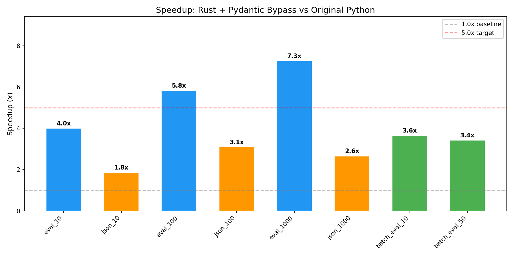

# Inspect Fast Loader — Rust Native Extension for inspect_ai

## Project Goal
Implement a Rust native extension (PyO3/maturin) that monkey-patches inspect_ai's log reading functions for 5-10x+ performance improvements. Focus on local file reading of `.eval` (ZIP) and `.json` formats.

## Phase: documentation_scaffold_setup (Complete)
See `write_up_documentation_scaffold_setup.md` for detailed findings.

- **Baseline established**: Full read of 1000 samples takes ~2s (.eval) / ~1.2s (.json). Header-only reads are already fast (~3-5ms).
- **Main bottleneck identified**: Pydantic model_validate on EvalSample.
- **Infrastructure ready**: Rust project compiles/imports, test log generator, 28 tests passing, benchmark operational.

## Phase: core_rust_implementation (Complete)
See `write_up_core_rust_implementation.md` for detailed findings and plots.

- **.eval full read 1000 samples**: 2047ms → 968ms (**2.12x speedup**)
- **Pydantic model_validate remained the dominant bottleneck** — bypassed in next phase

## Phase: pydantic_bypass_optimization (Complete)
See `write_up_pydantic_bypass_optimization.md` for detailed findings and plots.

### Key Results
| Operation | Original | Fast | Speedup |
|---|---|---|---|
| .eval full read 1000 samples | 2052ms | 283ms | **7.25x** |
| .eval full read 100 samples | 171ms | 30ms | **5.81x** |
| .json full read 1000 samples | 855ms | 323ms | **2.64x** |
| batch headers 50 .eval files | 98ms | 29ms | **3.42x** |

**Primary target of 5x+ for .eval full reads achieved (7.25x).**

### What Was Built
- `_construct.py`: Direct Pydantic model construction bypassing model_validate (~20x faster per-sample)
- Rayon parallel JSON parsing in Rust (GIL released during computation)
- .json format now uses bypass instead of falling back to original (2.64x speedup)
- Scorer placeholder replacement applied manually post-construction
- 103 tests total, all passing

### How the Bypass Works
`_fast_construct()` creates Pydantic model instances by directly setting `__dict__`, skipping all validators, type coercion, and `model_post_init`. All nested types are recursively constructed as proper Pydantic model instances. Migrations from `model_validate` are replicated in Python.

## Important Choices
- Test logs generated via direct JSON/ZIP construction (simpler, verified loadable)
- Monkey-patching approach: replace 4 functions on `inspect_ai.log._file` module
- NaN/Inf: pre-processing sentinel approach (simple, fast, correct)
- Direct `__dict__` assignment over `model_construct` (avoids model_post_init UUID generation)
- All nested types constructed as proper Pydantic models (not left as dicts) for correct model_dump()
- .json format: now uses Rust parser + bypass (was 1.0x fallback, now 2.64x)
- Header-only single-file: still falls back to original (original's targeted range reads are faster)
- Batch headers: use Rust in threads for true parallelism (3.42x speedup)
