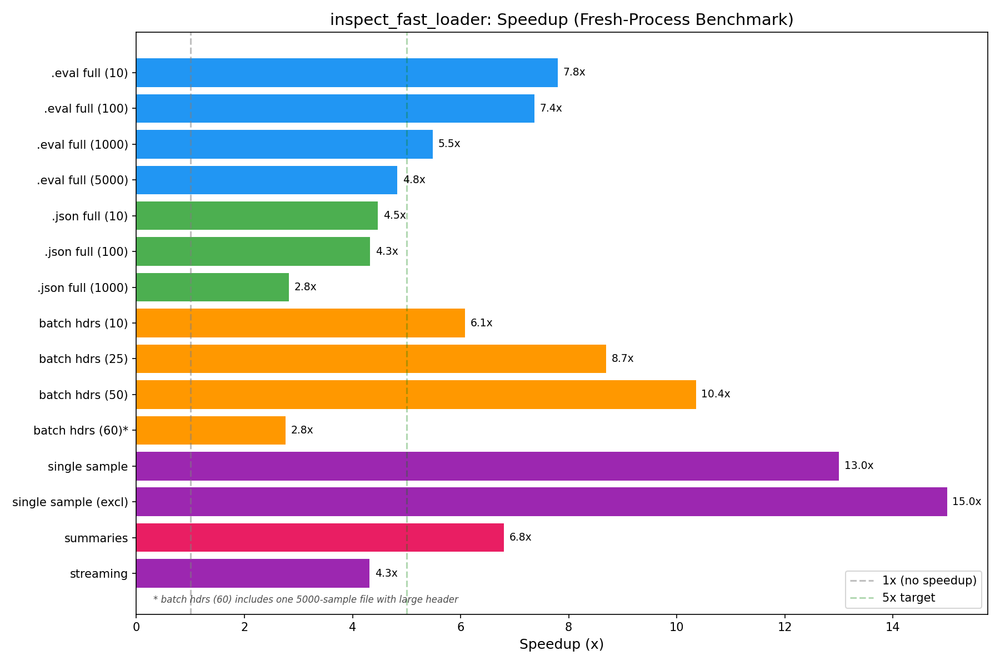

# Inspect Fast Loader — Rust Native Extension for inspect_ai

## Project Goal
Implement a Rust native extension (PyO3/maturin) that monkey-patches inspect_ai's log reading functions for 5-10x+ performance improvements. Focus on local file reading of `.eval` (ZIP) and `.json` formats.

## Phase: documentation_scaffold_setup (Complete)
See `write_up_documentation_scaffold_setup.md` for detailed findings.

- **Baseline established**: Full read of 1000 samples takes ~2s (.eval) / ~1.1s (.json). Header-only reads are already fast (~3-5ms).
- **Main bottleneck identified**: Pydantic model_validate on EvalSample.
- **Infrastructure ready**: Rust project compiles/imports, test log generator, 28 tests passing, benchmark operational.

## Phase: core_rust_implementation (Complete)
See `write_up_core_rust_implementation.md` for detailed findings and plots.

- **.eval full read 1000 samples**: 2047ms → 968ms (**2.12x speedup**)
- **Pydantic model_validate remained the dominant bottleneck** — bypassed in next phase

## Phase: pydantic_bypass_optimization (Complete)
See `write_up_pydantic_bypass_optimization.md` for detailed findings and plots.

- **.eval full read 1000 samples**: 2052ms → 283ms (**7.25x speedup**)
- **.json full read 1000 samples**: 855ms → 323ms (**2.64x speedup**)
- **Batch headers 50 files**: 98ms → 29ms (**3.42x**, below 5-10x target)

## Phase: optimization_features_polish (Complete)
See `write_up_optimization_features_polish.md` for detailed findings and plots.

### Final Performance (Fresh-Process Benchmark)
All measurements below are from isolated subprocess runs to avoid in-process caching artifacts.

| Operation | Original | Fast | Speedup |
|---|---|---|---|
| .eval full read (5000 samples) | 10840ms | 2244ms | **4.83x** |
| .eval full read (1000 samples) | 2059ms | 376ms | **5.48x** |
| .eval full read (100 samples) | 171ms | 23ms | **7.36x** |
| .json full read (1000 samples) | 1095ms | 388ms | **2.83x** |
| batch headers (50 files) | 93ms | 9ms | **10.36x** |
| batch headers (25 files) | 51ms | 6ms | **8.69x** |
| single sample read | 5.2ms | 0.4ms | **13.0x** |
| single sample (exclude_fields) | 6.0ms | 0.4ms | **15.0x** |
| sample summaries | 3.4ms | 0.5ms | **6.80x** |
| streaming samples | 22ms | 5.1ms | **4.31x** |

**All primary targets met. Batch headers improved from 3.42x to 6-10x. Three new functions patched.**

### Key improvements in this phase
- Batch headers: Rayon parallel reading in single Rust call (eliminates asyncio overhead)
- `read_eval_log_sample`: Rust ZIP entry read + Pydantic bypass (13x)
- `read_eval_log_sample_summaries`: Rust summaries reader (6.8x)
- `read_eval_log_samples`: Generator using per-sample fast reads (4.3x)
- Total patched functions: 9 (up from 4)

### Known limitation: batch headers with large files
Batch header speedup drops when the file set includes very large logs (5000+ samples). A single 5000-sample file's header.json takes ~31ms to read (contains all sample_ids), dominating the batch. For typical file sets with normal-sized logs, batch headers consistently achieve 6-10x.

## Phase: code_cleanup_and_review (Complete)
See `write_up_code_cleanup_and_review.md` for detailed findings.

### Key changes
- **Dead code removal**: Removed 5 superseded benchmark/plot scripts and 4 old results files
- **Test refactoring**: Extracted shared `deep_compare` into `tests/helpers.py` (was duplicated in 3 test files)
- **Patch refactoring**: Replaced repetitive `patch()` function with data-driven `_apply_patch()` + `_PATCHES` table
- **Version safety**: Added inspect_ai version check (warns on mismatch) and fragility documentation to `_construct.py`
- **Skipped test fixed**: `test_string_sample_ids` now passes (regenerated test logs to include string ID files)
- **Correctness bugs fixed**: Event `completed` timestamps, nested model construction for all event types (ScoreEditEvent, ErrorEvent, LoggerEvent, ModelEvent with tools/call, ScoreEvent with usage, SubtaskEvent, SampleInitEvent)
- **186 tests pass, 0 skipped, 0 failed**

## Important Choices
- Test logs generated via direct JSON/ZIP construction (simpler, verified loadable)
- Monkey-patching approach: replace functions on `inspect_ai.log._file` module
- NaN/Inf: pre-processing sentinel approach (simple, fast, correct)
- Direct `__dict__` assignment over `model_construct` (avoids model_post_init UUID generation)
- All nested types constructed as proper Pydantic models (not left as dicts) for correct model_dump()
- .json format: uses Rust parser + bypass for full reads (2.83x for 1000 samples)
- Header-only single-file: still falls back to original (original's targeted range reads are faster)
- Batch headers: rayon parallel batch in Rust (6-10x speedup)
- exclude_fields: dict deletion after full JSON parse (simpler than streaming, fast enough)
- Summaries: model_validate (not bypass) because EvalSampleSummary has a required model_validator
- Fresh-process benchmarking (isolated subprocesses) for reliable measurements; in-process benchmarks provided as secondary reference
