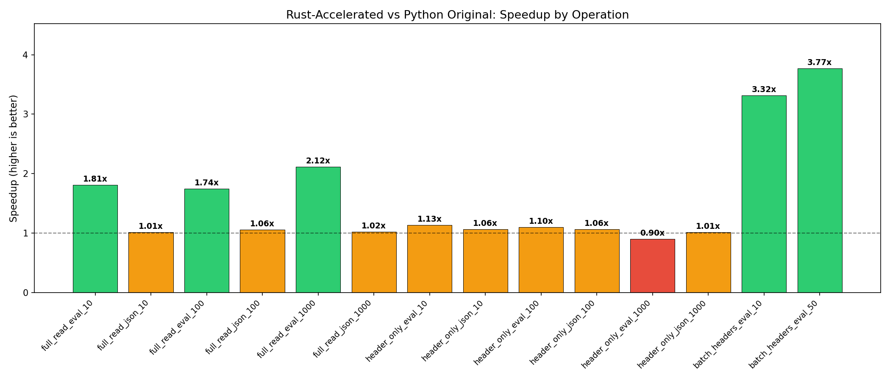

# Inspect Fast Loader — Rust Native Extension for inspect_ai

## Project Goal
Implement a Rust native extension (PyO3/maturin) that monkey-patches inspect_ai's log reading functions for 5-10x+ performance improvements. Focus on local file reading of `.eval` (ZIP) and `.json` formats.

## Phase: documentation_scaffold_setup (Complete)
See `write_up_documentation_scaffold_setup.md` for detailed findings.

- **Baseline established**: Full read of 1000 samples takes ~2s (.eval) / ~1.2s (.json). Header-only reads are already fast (~3-5ms).
- **Main bottleneck identified**: Pydantic model_validate on EvalSample.
- **Infrastructure ready**: Rust project compiles/imports, test log generator, 28 tests passing, benchmark operational.

## Phase: core_rust_implementation (Complete)
See `write_up_core_rust_implementation.md` for detailed findings and plots.

### Key Results
- **.eval full read 1000 samples**: 2047ms → 968ms (**2.12x speedup**)
- **.eval full read 100 samples**: 165ms → 95ms (**1.74x speedup**)
- **Batch headers (50 .eval files)**: 99ms → 26ms (**3.77x speedup**)
- **.json format / header-only**: Falls back to original (~1.0x, no regressions)
- **Pydantic model_validate remains the dominant bottleneck** — must be bypassed for 5x+ targets

### What Was Built
- Rust NaN/Inf-safe JSON parser (pre-processing sentinel approach)
- Rust `.eval` reader: ZIP decompression + JSON parsing → Python dicts
- Rust `.json` reader: available but falls back to original (pydantic_core.from_json is faster)
- Monkey-patching: replaces 4 functions; Rust used for .eval full reads and batch headers
- 70 tests total (42 correctness + 28 existing), all passing

## Important Choices
- Test logs generated via direct JSON/ZIP construction (simpler, verified loadable)
- Monkey-patching approach: replace 4 functions on `inspect_ai.log._file` module
- NaN/Inf: pre-processing sentinel approach (simple, fast, correct)
- .json format: fall back to original (pydantic_core.from_json is already Rust-backed and faster)
- Header-only single-file: fall back to original (original's targeted range reads are faster)
- Batch headers: use Rust in threads for true parallelism (3.77x speedup)
- IO[bytes] input: fall back to original (Rust functions expect file paths)
