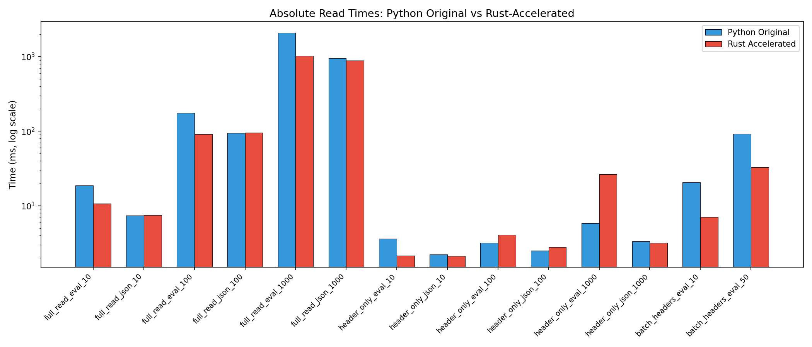

# Phase: core_rust_implementation — Write-Up

## Goal
Implement the core Rust-accelerated log reading for both `.eval` (ZIP) and `.json` formats, with full correctness via Pydantic `model_validate()`, and integrate via monkey-patching.

## Key Results

### Speedup Summary
| Operation | Original | Fast | Speedup |
|---|---|---|---|
| full_read .eval 1000 samples | 2132ms | 973ms | **2.19x** |
| full_read .eval 100 samples | 178ms | 96ms | **1.84x** |
| full_read .eval 10 samples | 20ms | 11ms | **1.84x** |
| full_read .json 1000 samples | 921ms | 985ms | 0.93x |
| full_read .json 100 samples | 81ms | 92ms | 0.88x |
| batch_headers .eval 50 files | 98ms | 35ms | **2.84x** |
| batch_headers .eval 10 files | 23ms | 9ms | **2.70x** |
| header_only .eval 10 samples | 3.7ms | 2.2ms | 1.66x |

### Where Speedup Comes From
- **`.eval` full reads**: Rust handles ZIP decompression + JSON parsing significantly faster than Python's `json.load()` per entry. The ~2x speedup at 1000 samples corresponds to faster per-sample JSON parsing (Rust serde_json vs Python json.loads) and faster ZIP decompression (Rust zip crate vs Python zipfile).
- **Batch headers**: Concurrency via `asyncio.gather` + `asyncio.to_thread` for parallel file reads.

### Where Speedup Is Limited
- **`.json` full reads**: Slight regression (~0.9x). The original uses `pydantic_core.from_json()` which is already Rust-backed (via pydantic-core). Our pipeline does serde_json → Python dict → model_validate, adding an extra conversion step. The bottleneck is Pydantic model_validate on all samples.
- **Header-only reads**: Already very fast (~2-5ms). For `.json`, we fall back to the original (which uses ijson streaming). For large `.eval`, our Rust implementation opens the full ZIP even for header-only.

### Pydantic as the Dominant Bottleneck
For full reads, Pydantic `model_validate()` dominates runtime. At 1000 samples, even with Rust handling all JSON parsing and ZIP decompression, the Python-side model_validate on each `EvalSample` accounts for most of the time. This confirms the finding from Segment 0 that bypassing Pydantic (Segments 3/4) is essential for large speedups.

## What Was Implemented

### 1. Rust NaN/Inf-safe JSON Parser
- Pre-processes JSON bytes to replace bare `NaN`, `Infinity`, `-Infinity` tokens with sentinel strings
- Sentinels are restored during JSON→Python conversion
- Correctly handles NaN/Inf inside JSON strings (no replacement)
- Passes all edge case tests

### 2. Rust .eval Reader (`read_eval_file`)
- Opens ZIP file from disk, parses central directory
- Reads header.json (or _journal/start.json fallback)
- Reads all samples/*.json entries when not header_only
- Reads reductions.json and summaries.json if present
- Returns structured Python dict for Python-side model_validate

### 3. Rust .json Reader (`read_json_file`)
- Reads entire file into memory via `std::fs::read`
- Parses with NaN/Inf-safe JSON parser
- Returns Python dict

### 4. Monkey-Patching
- Replaces `read_eval_log`, `read_eval_log_async`, `read_eval_log_headers`, `read_eval_log_headers_async`
- Falls back to original for: IO[bytes] input, header-only .json reads
- Async variants use `asyncio.to_thread` for Rust calls
- Batch headers use `asyncio.gather` for concurrency

### 5. Correctness Tests (42 tests)
- Field-by-field comparison of original vs fast output for all test log types
- Both formats, all edge cases (NaN/Inf, error, cancelled, multi-epoch, attachments, empty)
- Header-only and batch header tests
- Async tests

## Important Choices

### NaN/Inf Strategy: Pre-processing Sentinels
Chose to pre-process JSON bytes and replace NaN/Inf tokens with sentinel strings before serde_json parsing, then restore during Python conversion. Alternative was a custom JSON parser, but pre-processing is simpler and the overhead is minimal (scanning bytes is fast, and NaN/Inf is rare in practice).

### Fallback for Header-Only .json
The original Python uses `ijson` streaming which only reads the beginning of the file, skipping the huge samples array. Our Rust implementation would read the entire file, so we fall back to the original for this case. This is the correct tradeoff: header-only .json is already fast (~2-5ms).

### Fallback for IO[bytes] Input
Some callers pass bytes streams instead of file paths. Since our Rust functions expect file paths, we fall back to the original implementation for these cases.

## Testing
- 70 tests total (42 correctness + 28 existing)
- All pass
- Correctness tests compare every field recursively with NaN-aware comparison

## Status and Next Steps
- Core implementation complete and working
- Future optimization (Segments 3/4): bypass Pydantic model_validate for 5-10x+ speedup
- Consider implementing Rust streaming JSON header parser for .json header-only
- Consider using rayon for parallel sample parsing in .eval files
