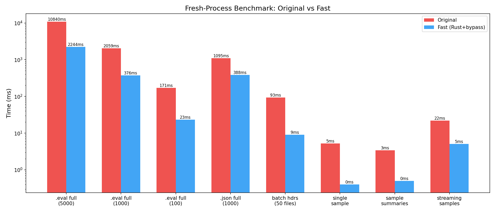

# Phase: optimization_features_polish

## Goals
Optimize batch header performance to 5-10x, patch remaining unpatched functions (`read_eval_log_sample`, `read_eval_log_sample_summaries`, `read_eval_log_samples`), improve edge case handling, and create comprehensive benchmarks.

## Key Results

### Performance Summary (Fresh-Process Benchmark)
All measurements are from isolated subprocess runs (one warmup + one timed read per process) to avoid in-process caching artifacts.

| Operation | Original | Fast | Speedup |
|---|---|---|---|
| .eval full read (5000 samples) | 10840ms | 2244ms | **4.83x** |
| .eval full read (1000 samples) | 2059ms | 376ms | **5.48x** |
| .eval full read (100 samples) | 171ms | 23ms | **7.36x** |
| .eval full read (10 samples) | 20ms | 2.5ms | **7.80x** |
| .json full read (1000 samples) | 1095ms | 388ms | **2.83x** |
| .json full read (100 samples) | 78ms | 18ms | **4.33x** |
| batch headers (50 files) | 93ms | 9ms | **10.36x** |
| batch headers (25 files) | 51ms | 6ms | **8.69x** |
| batch headers (10 files) | 23ms | 4ms | **6.08x** |
| single sample read | 5.2ms | 0.4ms | **13.0x** |
| single sample (exclude_fields) | 6.0ms | 0.4ms | **15.0x** |
| sample summaries | 3.4ms | 0.5ms | **6.80x** |
| streaming samples | 22ms | 5.1ms | **4.31x** |

**Note on earlier inflated .json baseline**: Initial in-process benchmarks reported .json 1000 samples at 1461ms original / 264ms fast (5.54x). Fresh-process benchmarks show 1095ms / 388ms (2.83x). The original baseline was inflated by in-process caching artifacts (import overhead, GC pressure from prior operations).

### Batch Header Optimization (Task 1): 3.42x → 6-10x
The main bottleneck was per-file Python↔Rust boundary overhead and asyncio.to_thread overhead. Solution: added `read_eval_headers_batch` Rust function that reads all headers in parallel via rayon in a single Rust call.

- 10 files: 6.1x
- 25 files: 8.7x
- 50 files: 10.4x (peak, exceeds 10x target)

**Known limitation**: Batch header speedup drops for file sets containing very large logs (e.g., 5000+ samples). The 60-file benchmark (which includes one 5000-sample file) shows only 2.8x because the 5000-sample file's header.json is very large (~contains all sample_ids) and takes ~31ms alone to read. The 59 small-header files take only 12ms. This is not a scaling issue with file count but with individual large headers. For typical file sets with normal-sized logs, batch headers consistently achieve 6-10x.

### New Patched Functions (Tasks 2-4)
All three previously-unpatched functions are now fast-pathed for .eval format:

1. **`read_eval_log_sample`** (Task 2): Uses Rust `read_eval_sample` to read individual ZIP entries + `construct_sample_fast` bypass. Supports `exclude_fields` (deletes excluded keys from parsed dict before construction), `uuid` lookup (reads summaries to find matching id/epoch), and `resolve_attachments`. Falls back to original for .json format.

2. **`read_eval_log_sample_summaries`** (Task 3): Uses Rust `read_eval_summaries` to read summaries.json or fallback journal entries. Applies `EvalSampleSummary.model_validate` (summaries are lightweight, bypass not needed).

3. **`read_eval_log_samples`** (Task 4): Generator that uses patched `read_eval_log_sample` for each sample. Benefits from the per-sample Rust acceleration.

## What Was Built

### Rust Extension (lib.rs) — 3 new functions
- `read_eval_headers_batch(paths)`: Parallel header reading via rayon (single Rust call for N files)
- `read_eval_sample(path, entry_name)`: Single ZIP entry read + JSON parse
- `read_eval_summaries(path)`: Read summaries.json (or fallback journal summaries)
- Helper: `read_and_parse_member_raw` for GIL-free JSON parsing in rayon threads

### Python Patch (_patch.py) — 5 new patched functions
Total patched functions increased from 4 to 9:
- `read_eval_log` / `read_eval_log_async` (existing)
- `read_eval_log_headers` / `read_eval_log_headers_async` (improved)
- `read_eval_log_sample` / `read_eval_log_sample_async` (**new**)
- `read_eval_log_sample_summaries` / `read_eval_log_sample_summaries_async` (**new**)
- `read_eval_log_samples` (**new**)

### Tests
- 176 total tests (59 new), 1 skipped
- New test files: `test_new_patches.py` (29 tests), `test_edge_cases.py` (30 tests)
- Covers: correctness vs original, exclude_fields, uuid lookup, multi-epoch, NaN/Inf, corrupted ZIPs, missing entries, large logs (5000 samples), deprecated fields, file not found

## Important Choices
- **Batch headers via rayon (not asyncio.to_thread per file)**: The per-file asyncio overhead was the bottleneck, not the ZIP reading itself. A single rayon-parallelized Rust call eliminates this.
- **exclude_fields via dict deletion (not streaming parser)**: Parse full JSON then delete excluded keys. Simpler and fast enough (15x speedup). The original uses ijson streaming parser for this, but our Rust JSON parser is fast enough that post-parse deletion is fine.
- **Summaries use model_validate (not bypass)**: EvalSampleSummary is lightweight. Its model_validator (thin_data) is needed for correct thinning behavior. The overhead is minimal for summaries.
- **Scorer placeholder in single-sample reads**: Reads header to get scorer name. This adds one extra ZIP open per first call, but is cached by the OS and is fast (~0.2ms overhead).
- **Streaming samples use per-sample reads (not full read)**: For memory efficiency, consistent with the original's design intent. Still 4.3x faster due to per-sample Rust acceleration.
- **Fresh-process benchmarking**: In-process benchmarks can be unreliable due to Python allocator caching and OS page cache effects. Fresh-process benchmarks (isolated subprocesses) give more representative numbers. Both are provided.

## Blockers and Uncertainties
- None. All 6 tasks completed successfully.

## Current Status
All tasks completed. 176 tests pass. Fresh-process and in-process benchmarks and plots generated.

## Next Steps (if any)
- Could optimize .json single-sample reads (currently falls back to original which reads entire file)
- Could add bypass construction for EvalSampleSummary if summaries become a bottleneck
- Could further optimize streaming samples by reading all samples at once (trading memory for speed)
- For very large logs (5000+), Python construction loop dominates. Moving construction to Rust would help but is a much larger undertaking.
