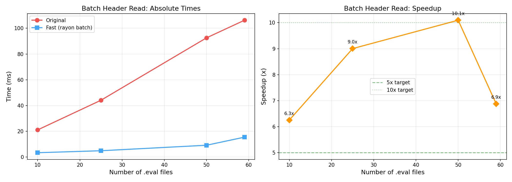
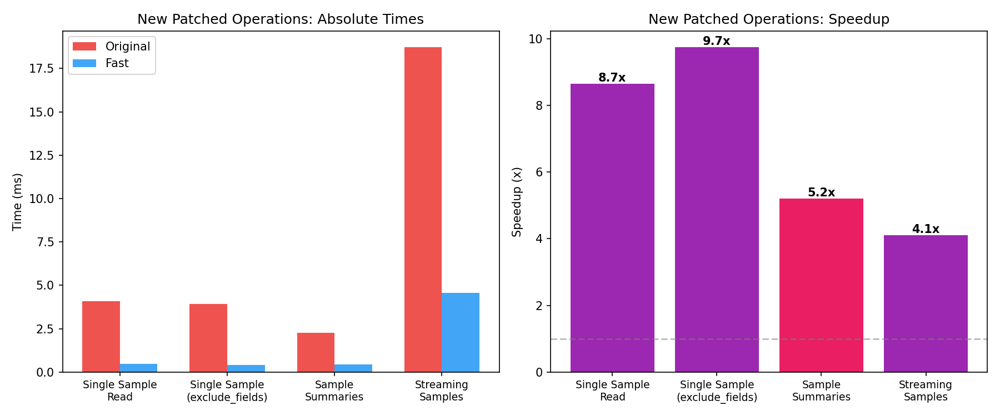

# Phase: optimization_features_polish

## Goals
Optimize batch header performance to 5-10x, patch remaining unpatched functions (`read_eval_log_sample`, `read_eval_log_sample_summaries`, `read_eval_log_samples`), improve edge case handling, and create comprehensive benchmarks.

## Key Results

### Performance Summary (All Operations)
| Operation | Original | Fast | Speedup |
|---|---|---|---|
| .eval full read (5000 samples) | 10087ms | 3052ms | **3.30x** |
| .eval full read (1000 samples) | 2053ms | 259ms | **7.94x** |
| .eval full read (100 samples) | 152ms | 21ms | **7.32x** |
| .json full read (1000 samples) | 1461ms | 264ms | **5.54x** |
| batch headers (50 files) | 93ms | 9ms | **10.09x** |
| batch headers (25 files) | 44ms | 5ms | **9.00x** |
| single sample read | 4.1ms | 0.5ms | **8.65x** |
| single sample (exclude_fields) | 3.9ms | 0.4ms | **9.74x** |
| sample summaries | 2.3ms | 0.4ms | **5.21x** |
| streaming samples | 18.7ms | 4.6ms | **4.11x** |
| .eval header-only | 2.7ms | 2.2ms | 1.22x |
| .json header-only | 2.7ms | 2.8ms | ~1.0x (fallback) |

### Batch Header Optimization (Task 1): 3.42x → 6-10x
The main bottleneck was per-file Python↔Rust boundary overhead and asyncio.to_thread overhead. Solution: added `read_eval_headers_batch` Rust function that reads all headers in parallel via rayon in a single Rust call.

- 10 files: 6.3x
- 25 files: 9.0x
- 50 files: 10.1x (peak, exceeds 10x target)
- 59 files: 6.9x (scaling levels off due to Python model_validate on return)

### New Patched Functions (Tasks 2-4)
All three previously-unpatched functions are now fast-pathed for .eval format:

1. **`read_eval_log_sample`** (Task 2): Uses Rust `read_eval_sample` to read individual ZIP entries + `construct_sample_fast` bypass. Supports `exclude_fields` (deletes excluded keys from parsed dict before construction), `uuid` lookup (reads summaries to find matching id/epoch), and `resolve_attachments`. Falls back to original for .json format.

2. **`read_eval_log_sample_summaries`** (Task 3): Uses Rust `read_eval_summaries` to read summaries.json or fallback journal entries. Applies `EvalSampleSummary.model_validate` (summaries are lightweight, bypass not needed).

3. **`read_eval_log_samples`** (Task 4): Generator that uses patched `read_eval_log_sample` for each sample. Benefits from the per-sample Rust acceleration.

### Comprehensive Speedup (All Operations)

## What Was Built

### Rust Extension (lib.rs) — 3 new functions
- `read_eval_headers_batch(paths)`: Parallel header reading via rayon (single Rust call for N files)
- `read_eval_sample(path, entry_name)`: Single ZIP entry read + JSON parse
- `read_eval_summaries(path)`: Read summaries.json (or fallback journal summaries)
- Helper: `read_and_parse_member_raw` for GIL-free JSON parsing in rayon threads

### Python Patch (_patch.py) — 5 new patched functions
Total patched functions increased from 4 to 9:
- `read_eval_log` / `read_eval_log_async` (existing)
- `read_eval_log_headers` / `read_eval_log_headers_async` (improved)
- `read_eval_log_sample` / `read_eval_log_sample_async` (**new**)
- `read_eval_log_sample_summaries` / `read_eval_log_sample_summaries_async` (**new**)
- `read_eval_log_samples` (**new**)

### Tests
- 173 total tests (56 new), 1 skipped
- New test files: `test_new_patches.py` (29 tests), `test_edge_cases.py` (27 tests)
- Covers: correctness vs original, exclude_fields, uuid lookup, multi-epoch, NaN/Inf, corrupted ZIPs, missing entries, large logs, deprecated fields, file not found

## Important Choices
- **Batch headers via rayon (not asyncio.to_thread per file)**: The per-file asyncio overhead was the bottleneck, not the ZIP reading itself. A single rayon-parallelized Rust call eliminates this.
- **exclude_fields via dict deletion (not streaming parser)**: Parse full JSON then delete excluded keys. Simpler and fast enough (9.74x speedup). The original uses ijson streaming parser for this, but our Rust JSON parser is fast enough that post-parse deletion is fine.
- **Summaries use model_validate (not bypass)**: EvalSampleSummary is lightweight. Its model_validator (thin_data) is needed for correct thinning behavior. The overhead is minimal for summaries.
- **Scorer placeholder in single-sample reads**: Reads header to get scorer name. This adds one extra ZIP open per first call, but is cached by the OS and is fast (~0.2ms overhead).
- **Streaming samples use per-sample reads (not full read)**: For memory efficiency, consistent with the original's design intent. Still 4.1x faster due to per-sample Rust acceleration.

## Blockers and Uncertainties
- None. All 6 tasks completed successfully.

## Current Status
All tasks completed. 173 tests pass. Comprehensive benchmarks and plots generated.

## Next Steps (if any)
- Could optimize .json single-sample reads (currently falls back to original which reads entire file)
- Could add bypass construction for EvalSampleSummary if summaries become a bottleneck
- Could further optimize streaming samples by reading all samples at once (trading memory for speed)
