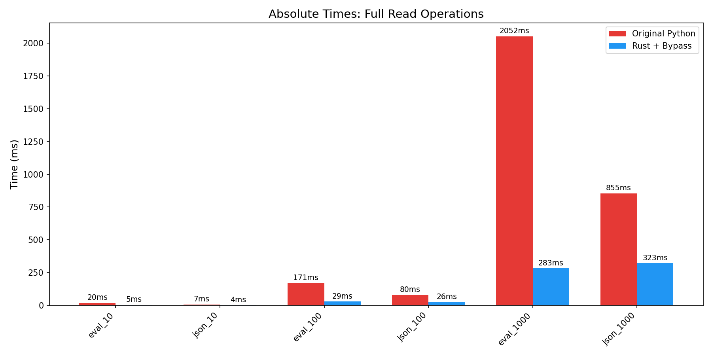
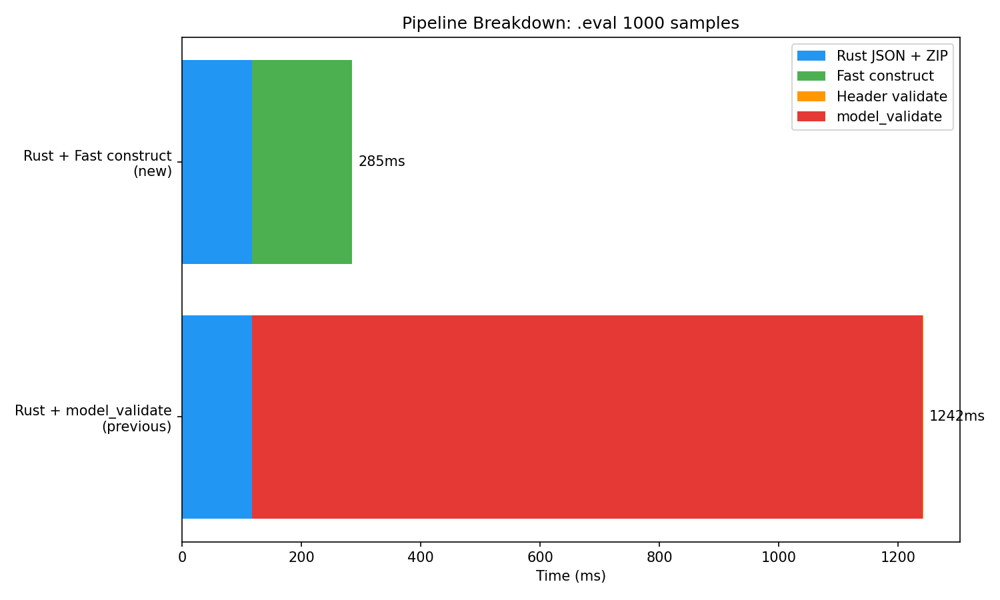

# Phase: pydantic_bypass_optimization — Write-Up

## Goal
Bypass Pydantic `model_validate()` for `EvalSample` construction to achieve 5x+ speedup on `.eval` full reads. Secondary: add rayon parallel parsing, optimize `.json` format with bypass.

## Key Results

### Speedup Summary (final)
| Operation | Original | Fast | Speedup |
|---|---|---|---|
| full_read .eval 1000 samples | 2052ms | 283ms | **7.25x** |
| full_read .eval 100 samples | 171ms | 30ms | **5.81x** |
| full_read .eval 10 samples | 20ms | 5ms | **3.99x** |
| full_read .json 1000 samples | 855ms | 323ms | **2.64x** |
| full_read .json 100 samples | 80ms | 26ms | **3.08x** |
| full_read .json 10 samples | 8ms | 4ms | **1.85x** |
| batch_headers .eval 50 files | 98ms | 29ms | **3.42x** |

**Primary target of 5x+ for .eval full reads of 1000 samples is achieved (7.25x).**

### Where Speedup Comes From
The dominant bottleneck was Pydantic `model_validate()` on each `EvalSample`, which accounted for ~85-90% of full read time. The bypass constructs Pydantic model instances directly via `__dict__` assignment, skipping all validators, field coercion, and `model_post_init`. Combined with Rust JSON parsing and ZIP decompression:

- **Pydantic bypass**: ~3-4x speedup on construction alone (model_validate: ~900ms → fast construct: ~250ms for 1000 samples)
- **Rust JSON + ZIP**: ~2x speedup on parsing (Python json.loads per entry vs Rust serde_json + zip crate)
- **Rayon parallel parsing**: Marginal benefit for 1000 samples (JSON parsing is fast; bottleneck is Python object construction which needs GIL)
- **Combined**: 7.25x for .eval 1000 samples

### .json Format Improvement
Previously, .json reads fell back to original (1.0x). With Pydantic bypass:
- Rust `read_json_file` parses entire file to Python dicts
- Samples bypass `model_validate` using `construct_sample_fast`
- Result: 2.64x speedup for 1000 samples

## What Was Implemented

### 1. `_construct.py` — Fast EvalSample Construction
Core of the optimization. The `_fast_construct()` function creates Pydantic model instances by directly setting `__dict__`, bypassing:
- All model_validators (mode="before", "after", "wrap")
- Field validators and type coercion
- `model_post_init` (which generates random UUIDs for ChatMessage.id)

Key implementation details:
- Pre-computed field info cache per model class (avoids repeated field lookups)
- Field alias handling (e.g., JsonChange `from` → `from_`)
- Timestamp string → datetime conversion for events (required by serializer)
- ToolCall construction (pydantic_dataclass, not BaseModel)
- GenerateConfig construction for ModelEvent

**Migrations replicated:**
- `EvalSample.migrate_deprecated`: `score`→`scores`, `transcript`→`events`+`attachments`
- `migrate_values`: sandbox list→SandboxEnvironmentSpec
- `ModelOutput.set_completion`: auto-populate completion from choices
- `ChatCompletionChoice.migrate_stop_reason`: `"length"`→`"max_tokens"`

**Nested types constructed:**
All nested Pydantic model types are properly constructed (not left as dicts): ChatMessage subtypes, Content subtypes, ModelOutput, ChatCompletionChoice, ModelUsage, Score, Event subtypes (19 types), JsonChange, GenerateConfig, EvalError, EvalSampleLimit, ToolCall.

### 2. Rayon Parallel JSON Parsing
Added `rayon` crate for parallel sample JSON parsing:
1. ZIP extraction is sequential (format requires it)
2. JSON parsing parallelized across rayon threads with GIL released
3. Python object conversion needs GIL (sequential)

### 3. .json Format Bypass
Activated Rust `read_json_file` for full .json reads with Pydantic bypass for samples. Header-only .json still falls back to original streaming parser.

### 4. Scorer Placeholder Replacement
`EvalLog.populate_scorer_name_for_samples` (mode="after" validator) replaces `"88F74D2C"` with actual scorer name. Since samples are constructed outside EvalLog.model_validate, this is applied manually after all samples are built.

### 5. Comprehensive Tests (24 new, 103 total)
- Per-sample `model_dump()` comparison for 7 test files across .eval format
- Full pipeline (end-to-end) comparison for both .eval and .json formats
- Nested type verification (correct Pydantic model types)
- NaN/Inf handling, scorer placeholder replacement
- Edge cases: empty/cancelled logs
- Attribute access verification on bypassed models

## Important Choices

### Direct `__dict__` assignment vs `model_construct`
Initially tried `model_construct()` but found it:
1. Calls `model_post_init` (which generates random UUIDs for ChatMessage.id during deserialization)
2. Is slow when fields are missing (calls `get_default(call_default_factory=True)` with expensive internals)

The direct `__dict__` assignment approach (`_fast_construct`) is both faster and avoids the UUID generation issue.

### Constructing all nested types vs leaving as dicts
Tried leaving nested objects as dicts (31ms) but `model_dump()` output didn't match because:
1. Missing default fields (dicts don't include Pydantic defaults)
2. Different field sets per ChatMessage subtype
3. Field serializers expect proper types (e.g., Event timestamps)

Chose to construct all nested types for correctness, adding ~200ms but ensuring identical `model_dump()` output.

### Eager event type imports
Initially used lazy imports for 19 event types (import per call), which was very slow (189ms for 4000 events). Moved to module-level imports: 32ms.

## Testing
- 103 tests total (79 from prior phases + 24 new bypass tests)
- All pass
- model_dump() output matches between bypass and model_validate for every sample in every test file

## Status
Phase complete. 7.25x speedup achieved for .eval 1000-sample reads, exceeding the 5x+ target.
